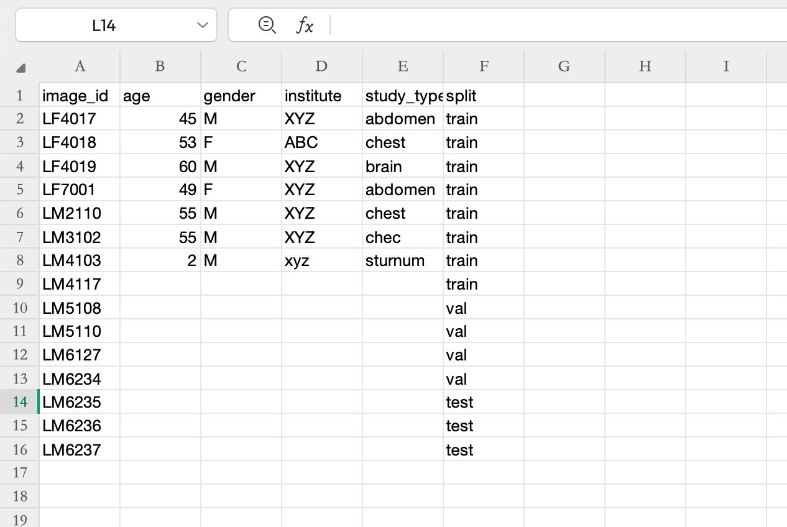

# 🧠 UMTRI_3D_Segmentation

A pipeline for segmentation of major anatomical structures in CT and MR images.  
This tool is trained on a wide variety of CT and MR scans from different institutions, scanners, and protocols, allowing it to generalize well to diverse inputs.

---

## 📂 Datasets

Currently We use Several key datasets in this project:

- 🦴 [Ribcage dataset (156 subjects)](https://www.dropbox.com/home/Xingyang%20Cui/TotalSegmentator_FineTuning)
- 🦶 [Foot & Ankle dataset (78 subjects)](https://armis2.arc-ts.umich.edu/pun/sys/dashboard/files/fs//nfs/turbo/coe-mreedsensitive/Processing/Foot_and_Ankle/SK/Raw_Data)
- [All other data](https://armis2.arc-ts.umich.edu/pun/sys/dashboard/files/fs//nfs/turbo/coe-mreedsensitive/Processing)(Hand, Neck, Cadaver etc.)

> ⚠️ *Note: The Foot & Ankle dataset is stored on UMich's ARC Turbo system. Please ensure you have access and are connected to the UMich network.*

---

## 🛠️ Installation Instructions

TotalSegmentator runs on **Ubuntu, Mac, and Windows**, and supports both **CPU** and **GPU** environments.

### ✅ Step 1: Set Up Python Environment

- Python >= 3.9  
- PyTorch >= 2.0.0 and < 2.6.0 (`< 2.4` for Windows)

Optionally:
* if you use the option --preview you have to install xvfb (apt-get install xvfb) and fury (pip install fury)


### ✅ Step 2: Install TotalSegmentator
```bash
pip install TotalSegmentator
```
Here is the instruction of how to run our basic segmentation model based on nnunet.


### Step 3: Install Required CT Software(3D Slicer & MeshLab)
These tools are required for visualization and mesh editing:

🧰 3D Slicer [🔗 Download 3D Slicer](https://www.meshlab.net/)            
– Open-source platform for medical image computing, mainly used to view `.nii.gz` CT images and 3D segmentation results [Instruction](https://github.com/XingyangCui/UMTRI_3D_Segmentation/blob/main/3D_Slicer_Instruction)

🧱 MeshLab [🔗 Download MeshLab](https://www.slicer.org/)    
– Tool for editing and visualizing 3D meshes for the STL version [Instruction](https://github.com/XingyangCui/UMTRI_3D_Segmentation/blob/main/MeshLab_Instruction)


-
-
-
# 🚀 Run Segmentation Pipeline (nnU-Net based)

This section explains how to train and evaluate our segmentation model using [nnU-Net](https://github.com/MIC-DKFZ/nnUNet).

---

### 🔧 Step 1: Setup nnU-Net

Follow the official nnU-Net installation guide:  
🔗 https://github.com/MIC-DKFZ/nnUNet

---

### 📁 Step 2: Convert the Dataset to nnU-Net Format

At first you need to have a plan with the data, like which should be the training or testing datasets. There have to create a csv file named meta.csv.
This file contains metadata for all image samples used in this project. Each row corresponds to a single 3D medical image, with optional attributes that may be used for analysis, filtering, or stratification:



*** 🧷 Required Columns
Column Name	Description
image_id	(Required) Unique identifier for each image. This must match the folder or file name used for segmentation.
split	(Required) Dataset split assignment. Must be one of: train, val, or test.

🧩 Optional Columns
Column Name	Description
age	Age of the subject in years. Useful for age-based analysis.
gender	Gender of the subject, typically M or F.
institute	Source institution or hospital where the image was acquired.
study_type	Region of interest or scan type (e.g., brain, chest, abdomen).

>⚠️ Note: Only image_id and split are required for the pipeline to run. Other columns are optional and may contain missing or noisy entries. For example, some study_type values may require cleaning (e.g., correcting typos like chec → chest).


Use the provided script:
```bash
python resources/convert_dataset_to_nnunet.py
```
For the dataset format, you can refer to the instruction [here](https://github.com/MIC-DKFZ/nnUNet/blob/master/documentation/dataset_format.md)
Usually the split results contain 5 parts: 
```
Dataset001_BrainTumour/
├── dataset.json
├── imagesTr
├── imagesTs  # optional
└── labelsTr
└── labelsTs  # optional
```

and this is how the details look like:
```
nnUNet_raw/Dataset001_BrainTumour/
├── dataset.json
├── imagesTr
│   ├── BRATS_001_0000.nii.gz
│   ├── BRATS_001_0001.nii.gz
│   ├── BRATS_001_0002.nii.gz
│   ├── BRATS_001_0003.nii.gz
│   ├── BRATS_002_0000.nii.gz
│   ├── BRATS_002_0001.nii.gz
│   ├── BRATS_002_0002.nii.gz
│   ├── BRATS_002_0003.nii.gz
│   ├── ...
├── imagesTs
│   ├── BRATS_485_0000.nii.gz
│   ├── BRATS_485_0001.nii.gz
│   ├── BRATS_485_0002.nii.gz
│   ├── BRATS_485_0003.nii.gz
│   ├── BRATS_486_0000.nii.gz
│   ├── BRATS_486_0001.nii.gz
│   ├── BRATS_486_0002.nii.gz
│   ├── BRATS_486_0003.nii.gz
│   ├── ...
└── labelsTr
    ├── BRATS_001.nii.gz
    ├── BRATS_002.nii.gz
    ├── ...
```
After split the data successfully, you can move to the next step.


### ⚙️ Step 3: Preprocess the Dataset

Use the nnU-Net preprocessing tool:
```bash
nnUNetv2_plan_and_preprocess -d <your_dataset_id> -pl ExperimentPlanner -c 3d_fullres -np 2
```
[Preprocess Code](https://github.com/XingyangCui/UMTRI_3D_Segmentation/blob/main/Code/Preprocess.ipynb)

To run data preprocessing with nnUNetv2, you need to set up the environment paths and execute the planning and preprocessing pipeline for your dataset.

✅ 1. Set Environment Variables
```bash
import os

os.environ["nnUNet_raw"] = "your/path/to/raw_data"                # Folder containing your DatasetXXX folder
os.environ["nnUNet_preprocessed"] = "your/path/to/preprocessed"  # Where preprocessed data will be stored
os.environ["nnUNet_results"] = "your/path/to/results"            # Directory for trained models and logs
```

✅ 2. Preprocess code
```bash
# Optional environment settings to avoid locale errors
env_vars = {
    "LC_ALL": "C.UTF-8",
    "LANG": "C.UTF-8"
}

# Build the nnU-Net planning command
command = [
    "nnUNetv2_plan_and_preprocess",
    "-d", "001",      # Replace with your Dataset ID (e.g., 001, 002, etc.)
    "-np", "6"        # Number of preprocessing threads (adjust to your CPU)
]
```
### Run the command with both system and custom environment variables
subprocess.run(command, env={**env_vars, **dict(os.environ)}, text=True)


### 🧠 Step 4: Train the Model

Use the `nnUNetTrainerNoMirroring` trainer to start training:

```bash
nnUNetv2_train <your_dataset_id> 3d_fullres 0 -tr nnUNetTrainerNoMirroring
```
<your_dataset_id>: Replace with your dataset ID (e.g., 002)

* 3d_fullres: Configuration for full-resolution 3D training

* 0: Fold number (typically 0 for default)

* -tr: Specifies the trainer to use

⏱️ Training may take several days depending on your hardware setup.

### 🔍 Step 5: Predict on the Test Set

Use the trained nnU-Net model to predict segmentations on the test set:

```bash
nnUNetv2_predict -i path/to/imagesTs \
                 -o path/to/labelsTs_predicted \
                 -d <your_dataset_id> \
                 -c 3d_fullres \
                 -tr nnUNetTrainerNoMirroring \
                 --disable_tta -f 0
```
* -i: Input directory of test images (e.g., imagesTs)

* -o: Output directory for predicted labels

* -d: Dataset ID (e.g., 002)

* -c: Configuration (e.g., 3d_fullres)

* -tr: Trainer used (e.g., nnUNetTrainerNoMirroring)

* --disable_tta: Disables test-time augmentation

* -f 0: Predict with fold 0


### 📊 Step 6: Evaluate Predictions

To evaluate the predicted segmentation results against ground truth labels, follow the steps below.

#### 1. Install Required Dependencies

```bash
pip install git+https://github.com/google-deepmind/surface-distance.git
pip install p_tqdm
```
#### 2. Run Evaluation Script
```bash
python resources/evaluate.py path/to/labelsTs path/to/labelsTs_predicted
```
* path/to/labelsTs: Directory containing the ground-truth labels.
* path/to/labelsTs_predicted: Directory containing the predicted segmentations.
This script will compute surface-based Dice scores and other metrics.
📄 Results can be compared with the baseline in resources/evaluate_results.txt
🎯 Note: Due to non-deterministic training, average Dice scores may vary by approximately ±1 point.

### 📊 Step 7: Done!!!

> Note: This will not give you the same results as 3D sgementation for two reasons:
1. 3D segmentation uses a bigger dataset which is not completely public
2. The origional model parameters use for training is different.
